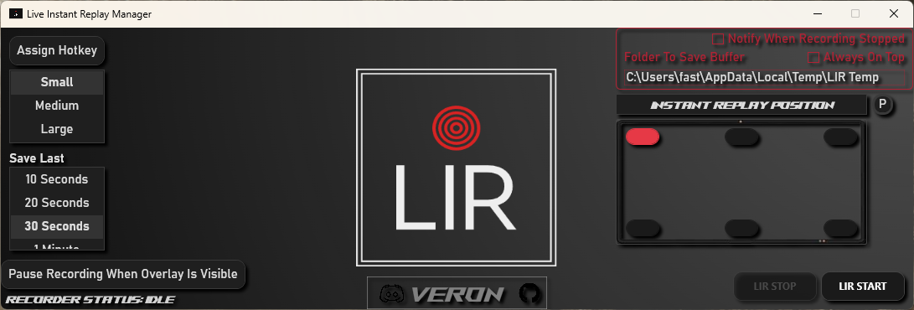

# 🎥 Live Instant Replay (LIR)

Live Instant Replay (LIR) is a lightweight Windows tool that shows an **instant replay** of the last *X seconds* of gameplay — right on your screen — without having to alt-tab or leave the game.

Perfect for gamers, streamers, or content creators who want to quickly review or react to clutch plays, fails, or epic moments while staying immersed in-game.

---

## 🖼️ Screenshot

---

## 🎬 Demo Video

[▶ Watch the demo video](https://your-link-to-video.com)  
*(Replace with your actual video link, YouTube or GitHub-hosted MP4)*

---

## ⚙️ Features

- 🔁 Instant in-game replay of the last X seconds
- ⏱️ Adjustable buffer duration
- 🎮 Designed to work over full-screen games
- 🧠 Smart overlay positioning (e.g., top-left, center-top, etc.)
- 🛠️ Simple UI, lightweight background usage

---

## 🚀 How to Use

1. **Download the latest ZIP** from the [Releases](https://github.com/your-username/LIR/releases) page
2. **Extract** it anywhere on your PC
3. **Run `LIR.exe`**
4. Configure your buffer length and hotkeys
5. Start your game and enjoy live replays!

---

## 📦 Download

👉 [Download the latest version here](https://github.com/your-username/LIR/releases/latest)

> ⚠️ No installation required. Just extract and run.

---

## 📋 License

This software is distributed as a **compiled binary only**.  
No source code is provided.  
See [`LICENSE.txt`](./LICENSE.txt) for usage restrictions.

---

## 💡 Coming Soon

- Multi-monitor support
- More overlay positioning options
- Replay saving/sharing
- UI theming

---

## 🧑‍💻 Developed By

**Zeyad Waleed**  
Made with ❤️ for competitive and casual gamers alike

---

